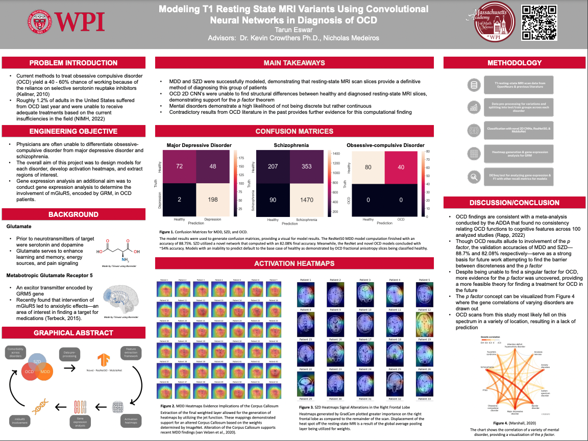

## Abstract
Obsessive-compulsive disorder (OCD) presents itself as a highly debilitating disorder. The disorder has common associations to the prefrontal cortex and the glutamate receptor known Metabotropic Glutamate Receptor 5 (mGluR5). This receptor has been observed to demonstrate higher levels of signaling from positron emission tomography scans measured by its distribution volume ratios. Though, studies are unable to verify the involvement of mGluR5. Computational modeling methods were used as a means of validation for previous hypotheses involving mGluR5. The inadequacies in relation to the causal factor of OCD were answered by utilizing T1 resting-state magnetic resonance imaging (TRS-MRI) scans of patients suffering from schizophrenia, major depressive disorder, and obsessive-compulsive disorder. Because comorbid cases often occur within these disorders, cross comparative abilities become necessary to find distinctive characteristics. After unique structures of tissues found in OCD TRS-MRI scans were identified, a gene expression analysis was conducted based on scan data output. Two-dimensional convolutional neural networks alongside ResNet50 and MobileNet models were constructed and evaluated for efficiency. Activation heatmaps of TRS-MRI scans were outputted, allowing for transcriptomics analysis. Though, a lack of ability of prediction of OCD cases prevented gene expression analysis. Across all models, there was an 88.75% validation accuracy for MDD, and 82.08% validation accuracy for SZD under the framework of ResNet50 as well as novel computation. OCD yielded an accuracy rate of ~54.4%. These results provided further evidence for the p factor theorem regarding mental disorders. Future work involves the application of transfer learning to bolster accuracy rates.

Keywords: Obsessive-compulsive disorder, magnetic resonance imaging, major depressive disorder, schizophrenia

## Problem Statement
Determining the root cause of obsessive-compulsive disorder is highly difficult. Physicians are often unable to differentiate obsessive-compulsive disorder from major depressive disorder (MDD) and schizophrenia (SZD). This lack of differentiation occurs because OCD is often comorbid with SZD and MDD.

## Engineering Objective
The overall aim of this project was to design models for each disorder, develop activation heatmaps, and extract regions of interest. Afterwards, gene expression analysis an additional aim was to conduct gene expression analysis to determine the involvement of mGluR5, encoded by GRM, in OCD.

# Project Documents

<a href="Docs/Eswar, Tarun - 2022-2023 Project Proposal.pdf" class="image fit">Project Proposal</a>

<a href="Docs/Eswar, Tarun - 2022-2023 Project Notes.pdf" class="image fit">Background Research</a>

<a href="Docs/Eswar, Tarun - 2022-2023 Project Documents.pdf" class="image fit">Logbook</a>

<a href="Docs/Eswar Thesis 2023v3.pdf" class="image fit">Thesis</a>

## Background
Over recent decades, obsessive compulsive disorder (OCD) has been ranked as one of the ten most disabling disorders (Murray and Lopez, 1996). A patient suffering from OCD will often experience a variety of symptoms, falling into two main categories: obsessions and compulsions. Obsessions refer to being overly focused on a specific issue, involving overthinking in the form of impulsions. Furthermore, compulsions reflect specific actions in order to counteract the obsessive symptoms. These can include checking and mental compulsions, though the list of specific compulsions varies by case (International OCD Foundation, 2010). The symptoms themselves are not rather concerning; however, concern arises in analysis of the impact of symptoms as a function of time. The fear that associated with failing to fulfill an impulse is the major component in the factors that push a diagnosed patient to follow their obsession. As a result, a sufferer of OCD typically spends an hour each day fixated on these debilitating symptoms (NIMH, 2019). Though, an hour worth of compulsion generalizes overall observations of an OCD cases. Those facing extreme cases of OCD can often face increased disruptions to daily life including the inability to participate at places of work or in school (Wood, 2018). Though OCD has been established as a severely debilitating condition, treatments and knowledge of the disorder is still developing. Current treatments involve utilizing Selective Serotonin Reuptake Inhibitors (SSRIs) as prior research hypothesized serotonin to be a target for effective treatment to the disorder. However, when tested, 40 to 60 percent of patients noticed none to partial improvements to their symptoms (Kellner, 2010). Identifying a singular root cause is difficult due to the comorbidity that often occurs with OCD and similar disorders. Therefore, there exists a need to differentiate and determine a causal factor.

## Methods
The methodology for this project followed a set of predetermined objectives. These included four required goals in order to meet the need of the project but also items that enhanced the overall scope of this project. (1) Construct individual CNNs with guidance from pre-trained networks for OCD, MDD, and Schizophrenia respectively with accuracy rates of at least 80%. (2) Develop activation heatmaps, demonstrating regions of interest unique to each disorder. (3) Perform gene expression analysis on T1 resting-state MRIs with transcriptomics. (4) Provide an online web application to allow patients to receive data from the models details in objective 1, as well as to feed more data into the models.
  
Novel 2D CNNs: Novel 2D convolutional neural networks were established for each disorder to provide proof of concept for further testing. Each novel CNN was composed of a sequential base, containing pooling, batch, and dropout layers to condense T1 MRI slices into a 1x1 matrix within the sigmoid layer. The model compiled with an Adam optimizer to reduce computation time (Yi, D., Ahn, J., & Ji, S., 2020). Furthermore, this optimization allowed for an easier load during the course of this proof of concept.
  
Optimized Neural Networks: Pre-trained frameworks were used post confirmation of functioning novel models. During pre-processing, slices with differentiating time stamps due to issues within the scan were excluded. Furthermore, T1 MRI scans noted as corrupted or missing by the primary author of each dataset were also excluded. During the usage of ResNet50, the ram requirement for 23.2 billion parameters surpassed the amount of resources available with the given hardware. As a result, the central 40 scans per each disorder model were utilized to allow for model compilation. Furthermore, MobileNet was also utilized, but to a lesser extent compared to ResNet50. During the first round of testing, MobileNet was excluded as a viable method for future testing after yielding lower accuracy rates.
  
Activation Heatmaps: Activation heatmaps of the neural network models were created following model development. In order to construct heatmaps, testing data was classified based on the prediction attribute of the model. Afterwards, the layer at index -1 was extracted to obtain weights of size 2048. Each of these prediction images was then layered above the original image in order to demonstrate the regions of interest.

## Analysis
The overall objective for this project was to develop models that would allow for the guidance of future research into identifying specific areas of OCD in terms of a causal factor. Afterwards, an extension for this project was to create an online web application that would allow sufferers of MDD and SZD to review statistics for their respective disorders.
  
In attempting to achieve these objectives, models for SZD and MDD were successfully constructed. The SZD model outputs an accuracy of 82.08% while MDD outputs 88.75%. Though model architectures did not remain constant. In the case of SZD, a novel architecture based on 2D CNN’s was utilized while for MDD ResNet50 served as the primary means of prediction. Furthermore, heatmaps were generated, identifying the corpus callosum’s alteration in MDD and alterations of the right frontal lobe in MDD. However, in the case of the OCD model, predictions were unable to occur. This inability most likely occurred due to a theory known as the p factor, which alludes to the idea that neurological disorders are on a continuum rather than discrete. As a result, when the model is unable to predict for OCD, different regions were most likely implicated in the resting-state scan, meaning that these patients exhibiting OCD symptoms most likely fell elsewhere on the spectrum of disorders.
  
In order to analyze the two working models, a two proportion z test was utilized. Past work for both disorders was pooled under on accuracy to demonstrate the significance the models in this study had against past work. In terms of SZD, our model had a P-value of ~0.117, not significant at alpha of 0.05 when cross compared to Filippis et al. However, the MDD model was significant with a P-value of ~0.04363, significant at alpha of 0.05 when cross compared to Gao et al. Though the OCD model was unable to predict, the idea that being unable to predict provides an insight into neurological disorders as a whole presents itself as a novel approach.

## Poster Presentation

